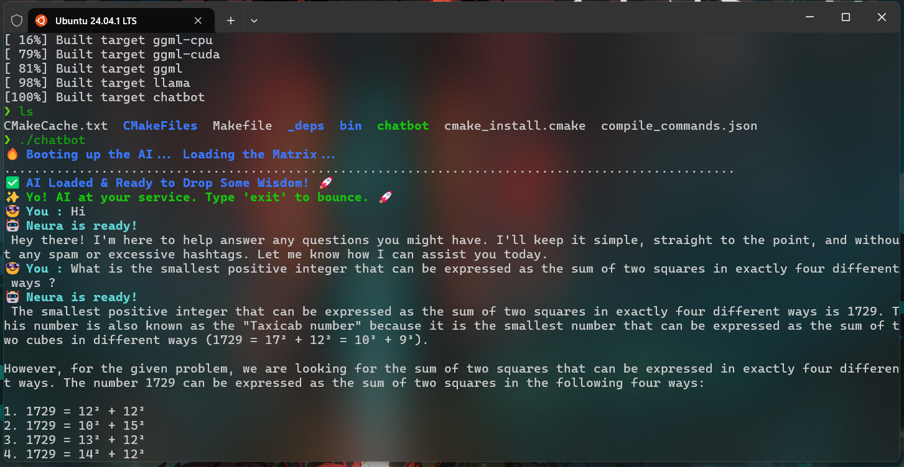

# Chatbot using llama.cpp

## **Project Overview**
This is a **C++-based chatbot** powered by `llama.cpp`, utilizing **Mistral-7B** or **Llama 2** models for natural language processing (NLP). The chatbot supports **real-time text generation**, **chat history**, and **custom personality responses**. It can run efficiently using **CPU or GPU acceleration**, making it suitable for low-VRAM devices like **RTX 4060 (6GB)**.

---

# AI Chatbot using Llama.cpp 🚀

## 📌 Project Demo

### 🔹 Chatbot Running


---

## **Installation & Setup**

### **1. Install Dependencies**
Before building the project, install the required dependencies:

#### **For Ubuntu/Debian**:
```sh
sudo apt update && sudo apt install -y cmake g++ make git libopenblas-dev
```

#### **For Arch Linux**:
```sh
sudo pacman -Syu cmake gcc make git openblas
```

#### **For Fedora**:
```sh
sudo dnf install cmake gcc-c++ make git openblas-devel
```

---

### **2. Clone the Repository**
```sh
git clone https://github.com/shrizz/chat-bot.git
cd chat-bot
```

---

### **3. Download the Model (Mistral-7B or Llama-2-7B)**
The chatbot requires a **quantized `.gguf` model**. Download a compatible model from Hugging Face:
```sh
wget --header="Authorization: Bearer <your_huggingface_token>" \
    https://huggingface.co/TheBloke/Mistral-7B-Instruct-v0.2-GGUF/resolve/main/mistral-7b-instruct-v0.2-q4_k_m.gguf
```
Move the model to the project folder:
```sh
mv mistral-7b-instruct-v0.2-q4_k_m.gguf chat-bot/model/
```

---

### **4. Build the Project**
```sh
mkdir -p build && cd build
cmake .. -DLLAMA_CUDA=ON  # Enable CUDA if using GPU
make -j$(nproc)
```

---

## **Usage**
Run the chatbot with the specified model:
```sh
./chatbot
```

---

## **Integrating AI with Your Shell (Bash/Zsh)**

### **Method 1: AI Autocompletion in Bash/Zsh**
💡 AI **suggests Linux commands** while you type and lets you **autocomplete with TAB**.

#### **Step 1: Add AI Autocomplete to Your Shell**
Edit your shell profile (`.bashrc` or `.zshrc`):
```sh
nano ~/.bashrc  # Or ~/.zshrc for Zsh
```
Add this at the bottom:
```sh
_ai_command_suggestion() {
    local input="$READLINE_LINE"
    local suggestion=$(~/.chatbot/chatbot "$input")  # Calls your chatbot
    if [[ -n "$suggestion" ]]; then
        READLINE_LINE="$suggestion"  # Auto-fills suggestion
        READLINE_POINT=${#READLINE_LINE}  # Move cursor to end
    fi
}

bind -x '"\t": _ai_command_suggestion'  # Trigger AI with the TAB key
```
Save & reload the shell:
```sh
source ~/.bashrc  # Or source ~/.zshrc for Zsh
```
Now, AI **suggests commands as you type** and lets you **press TAB to autocomplete**! 🚀

---

### **Method 2: AI-Enhanced Shell Mode**
💡 Every command runs **through AI** before execution.

#### **Step 1: Create an AI-Powered Shell Wrapper**
Create a new script:
```sh
mkdir -p ~/.chatbot
nano ~/.chatbot/ai_shell.sh
```
Paste this:
```sh
#!/bin/bash
while true; do
    read -p "🤖 AI-Shell> " cmd
    if [[ "$cmd" == "exit" ]]; then
        echo "👋 AI Shell Logging Out..."
        break
    fi

    # Call AI for suggestion
    ai_suggestion=$(~/.chatbot/chatbot "$cmd")
    if [[ -n "$ai_suggestion" ]]; then
        echo "💡 AI Suggestion: $ai_suggestion"
    fi

    # Execute command
    eval "$cmd"
done
```
Save & make it executable:
```sh
chmod +x ~/.chatbot/ai_shell.sh
```

#### **Step 2: Set as Default Shell (Optional)**
If you want **every new terminal session** to use AI:
```sh
chsh -s ~/.chatbot/ai_shell.sh
```
Now, whenever you open a terminal, the AI-powered shell starts!

---

## **Debugging & Performance Optimization**
- **Monitor VRAM usage:**
  ```sh
  watch -n 1 nvidia-smi
  ```
- **Reduce `--n-gpu-layers` if out-of-memory (OOM) errors occur.**
- **Run with debugging enabled:**
  ```sh
  export GGML_DEBUG=1
  ./chatbot
  ```
- **Use GDB to debug crashes:**
  ```sh
  gdb ./chatbot
  run
  bt  # Get backtrace
  ```

---

## **Cool Features** 🚀
- **Text Animation** 🎭 for engaging responses.
- **Fun & Casual Chat Mode** 🕶️😎 (Hood/Slang mode available).
- **Supports Both Terminal & API** usage.
- **Optimized for Low VRAM (4GB RTX 4060)**.
- **Multi-Turn Conversations with Context Awareness**.

---

## **Contributing**
Feel free to **open issues** or **submit pull requests** for improvements, new features, and bug fixes.

---
